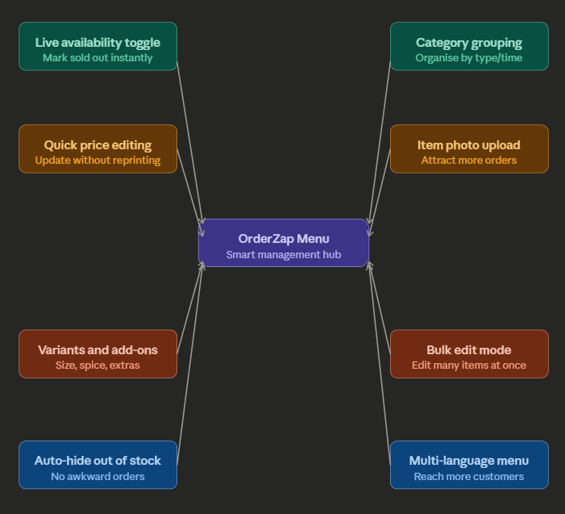
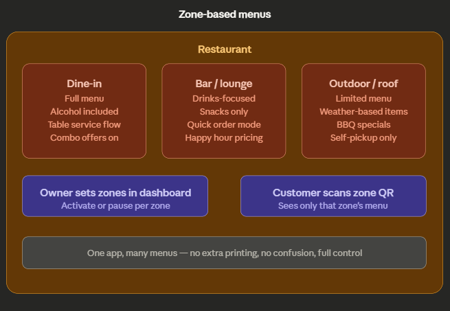

### Live availability toggle

owner marks an item sold out in one tap. No customer orders something unavailable, no refunds, no waste.

### Quick price editing

update prices on the app instantly. No need to reprint physical menus every time prices change

### Auto-hide out of stock

items with zero stock disappear from the customer menu automatically. Zero awkward situations.

### Bulk edit mode

update prices or availability for many items at once, not one by one.

### Category grouping

organise items by type (Starters, Mains, Drinks) or by time (Breakfast, Lunch, Dinner).

### Variants and add-ons

one item, multiple options (size, spice level, toppings). No duplicate entries needed.

### Item photo upload

food photos increase orders significantly. Owner uploads once, customers see it everywhere

### Multi-language menu

reach more customers without creating a separate menu.

### Zone-based menus

and bro right now we are making this for the manger or owner like the admin plane 

all this feature for the managing the menu of a restro

if u have a feature or idea for Menu - OZ, then share it here or text