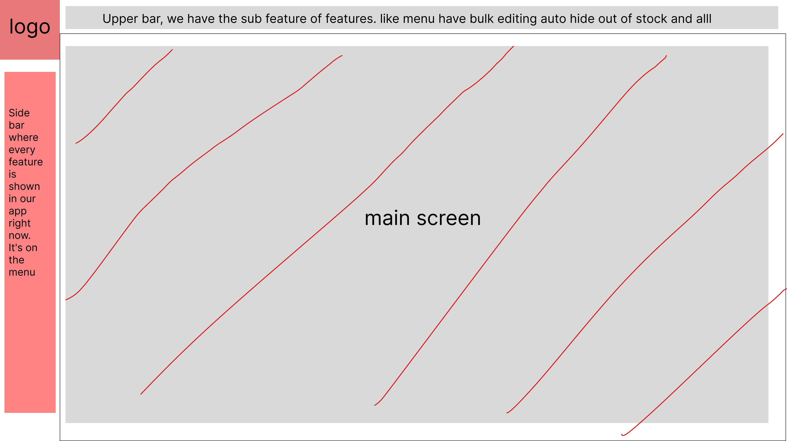

Red will be static and will never change.

Gray will be dynamic. It will change according to the features and functions.

The functions and options will be on the main screen only. The upper bar will allow users to quickly switch between features and access the main feature functions.